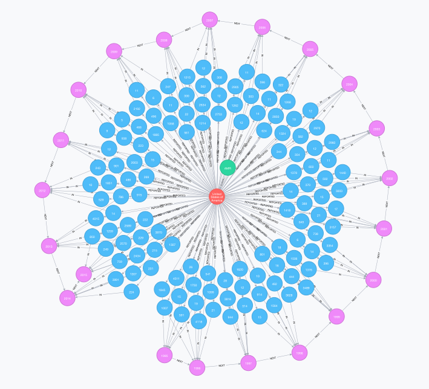

## NoSQL Migration

Our task for Project 4 was to migrate data from a relational database to a NoSQL database of our choosing.  I have used MySQL and Neo4j, interfacing with both using the __RMySQL__ and __RNeo4j__ packages.  My data are sourced from the World Health Organization's [Global Tuberculosis Database](http://www.who.int/tb/country/data/download/en/).  NOTE: running the R code below will download the WHO's Global TB datasets (~ 3.8 MB) into a folder named "tb" in your current working directory.

### Setup

#### Load required libraries

```{r setup, warning = FALSE, message = FALSE}
setwd("~/DATA 607 Data Acquisition and Management/Project4")
library(stringr)
library(dplyr)
library(tidyr)
library(RMySQL)
library(RNeo4j)
library(DT)
library(visNetwork)
```

```{r user-pw, echo = FALSE}
# store and retreive MySQL & Neo4j login info from R script 
source("~/Documents/Fall 2016/MySQL_Neo4j_Login.R")

# or uncomment the lines below and assign your usernames and passwords to variables
#username <- ###
#password <- ###
#neo4j_user <- ###
#neo4j_pw <- ###
```

#### Create "tb" subdirectory in current working directory

```{r tb-subdir, message = FALSE}
if(!dir.exists("tb")) {
  message("creating tb/ subdirectory")
  dir.create("tb")
} else {
  message("tb/ subdirectory already exists")
}
```

#### Download WHO's global tuberculosis data to "tb" subdirectory

```{r download-data, message = FALSE}
urls <- c("https://extranet.who.int/tme/generateCSV.asp?ds=dictionary",
         "https://extranet.who.int/tme/generateCSV.asp?ds=estimates",
         "https://extranet.who.int/tme/generateCSV.asp?ds=mdr_rr_estimates",
         "https://extranet.who.int/tme/generateCSV.asp?ds=ltbi_estimates",
         "https://extranet.who.int/tme/generateCSV.asp?ds=notifications",
         "https://extranet.who.int/tme/generateCSV.asp?ds=labs",
         "https://extranet.who.int/tme/generateCSV.asp?ds=tbhivnonroutinesurv",
         "https://extranet.who.int/tme/generateCSV.asp?ds=outcomes",
         "https://extranet.who.int/tme/generateCSV.asp?ds=policies",
         "https://extranet.who.int/tme/generateCSV.asp?ds=community")

download_tb_data <- function(url) {
  if(!file.exists(str_c("tb/", str_extract(url, "(?<=\\=).+$"), ".csv"))) {
    message(str_c("downloading ", str_extract(url, "(?<=\\=).+$"), ".csv", " to tb/ subdirectory"))
    download.file(url, file.path("tb", str_c(str_extract(url, "(?<=\\=).+$"), ".csv")), 
                method = "curl")
  }
  else {
    message(str_c("tb/", str_extract(url, "(?<=\\=).+$"), ".csv", " already exists"))
  }
}

for(i in 1:length(urls)) {
  download_tb_data(urls[i])
}
```

### MySQL

#### Connect to MySQL 

```{r connect-mysql}
con <- dbConnect(MySQL(), host = "localhost", username = username, password = password)
```

#### Create and populate WHO tuberculosis ("global_tb") database

The CSV files containing WHO's tuberculosis data were read into a list of data frames and then written into the MySQL database in order to preserve missing values as NULLs in MySQL.  Writing the database tables directly from the CSV files using the `dbWriteTable()` function rendered missing values as zeroes.

```{r mysql-tb-db, results = "hide"}
dbSendQuery(con, "DROP SCHEMA IF EXISTS global_tb;")
dbSendQuery(con, "CREATE SCHEMA global_tb;")
dbSendQuery(con, "USE global_tb;")

dbSendQuery(con, "
DROP TABLE IF EXISTS 
  community,
  dictionary,
  estimates,
  labs,
  ltbi_estimates,
  mdr_rr_estimates,
  notifications,
  outcomes,
  policies,
  tbhivnonroutinesurv;
")

files <- list.files(path = "tb", pattern = "\\.csv", full.names = TRUE)

tb_data <- lapply(files, function(x) read.csv(file = x, header = TRUE, 
                                              stringsAsFactors = FALSE,
                                              encoding = "UTF-8"))

names(tb_data) <- str_extract(files, "(?<=/).+(?=\\.)")

write_db_tables <- function(list) {
  for(i in 1:length(list)) {
    dbWriteTable(con, names(tb_data)[i], tb_data[[i]], 
                 header = TRUE, row.names = FALSE, overwrite = TRUE)
  }
}

write_db_tables(tb_data)
```

#### Reduce and tidy tb notifications data frame and write new DB table

```{r reduce-notifications, results = "hide"}
reduced_tb <- tb_data$notifications

red_leq12 <- reduced_tb %>% filter(year <= 2012) %>% 
  group_by(country, iso3, iso_numeric, g_whoregion, year) %>%
  summarize(m_child = new_sp_m014,
         m_adult = sum(new_sp_m1524, new_sp_m2534, new_sp_m3544, new_sp_m4554, new_sp_m5564),
         m_senior = new_sp_m65,
         f_child = new_sp_f014, 
         f_adult = sum(new_sp_f1524, new_sp_f2534, new_sp_f3544, new_sp_f4554, new_sp_f5564),
         f_senior = new_sp_f65)
  
red_geq13 <- reduced_tb %>% filter(year > 2012) %>% 
  group_by(country, iso3, iso_numeric, g_whoregion, year) %>%
  summarize(m_child = newrel_m014,
         m_adult = sum(newrel_m1524, newrel_m2534, newrel_m3544, newrel_m4554, newrel_m5564),
         m_senior = newrel_m65,
         f_child = newrel_f014, 
         f_adult = sum(newrel_f1524, newrel_f2534, newrel_f3544, newrel_f4554, newrel_f5564),
         f_senior = newrel_f65)
                        
reduced_tb <- bind_rows(red_leq12, red_geq13) %>% arrange(country, year)

reduced_tb <- reduced_tb %>% gather(category, new_cases, m_child:f_senior)

reduced_tb <- reduced_tb %>% 
  mutate(gender = ifelse(str_sub(category, 1, 1) == "m", "male", "female")) %>%
  mutate(category = str_sub(category, 3, -1)) %>% 
  rename(age_group = category) %>%
  select(country:year, gender, age_group, new_cases) %>% arrange(country, year, gender)

reduced_tb <- ungroup(reduced_tb)

dbSendQuery(con, "DROP TABLE IF EXISTS new_cases;")

dbWriteTable(con, "new_cases", reduced_tb, 
                 header = TRUE, row.names = FALSE, overwrite = TRUE)
```

#### Test query from "new_cases" table

```{r test-query}
knitr::kable(dbGetQuery(con, "
SELECT * FROM new_cases
WHERE iso3 = 'USA'
AND year = 2015;
"))
```

#### Write "new_cases" table as CSV file in current working directory

```{r new-cases-csv}
# write CSV from MySQL
#dbSendQuery(con, "
#SELECT * 
#INTO OUTFILE '/Users/Shared/Data/tb_new_cases.csv'
#FIELDS TERMINATED BY ',' OPTIONALLY ENCLOSED BY '\"'
#ESCAPED BY '\\\\'
#LINES TERMINATED BY '\\n'
#FROM (
#    SELECT 'country', 'iso3', 'iso_numeric', 'g_whoregion', 
#      'year', 'gender', 'age_group', 'new_cases'
#    UNION ALL
#    SELECT * FROM new_cases
#) csv_headers;
#")

# write CSV from R
write.csv(dbGetQuery(con, "SELECT * FROM new_cases"), "new_tb_cases.csv", row.names = FALSE)
```

#### Drop "global_tb" DB and disconnect from MySQL

```{r disconnect-mysql, warning = FALSE, message = FALSE}
dbSendQuery(con, "DROP SCHEMA global_tb;")
dbDisconnect(con)
```

### Neo4j

### Read-in "new_tb_cases.csv" and remove rows with missing data from data frame

```{r new-tb-cases-df}
new_tb_cases <- read.csv("new_tb_cases.csv", header = TRUE, stringsAsFactors = FALSE)
new_tb_cases <- new_tb_cases[!is.na(new_tb_cases$new_cases), ]
```

#### Connect to Neo4J database

```{r connect-neo4j}
graph <- startGraph("http://localhost:7474/db/data/", username = neo4j_user, password = neo4j_pw)
clear(graph, input = FALSE)
```

#### Add uniqueness constraints and define import query

```{r tb-graph}
addConstraint(graph, "Region", "who_region")
addConstraint(graph, "Country", "country")
addConstraint(graph, "Year", "year")

create_query <- "
CREATE (new_tb_cases:Notification {count:TOINT({new_cases}), gender:{gender}, age_group:{age_group}})

MERGE (who_region:Region {region:{region}})
MERGE (country:Country {country:{country}, iso3:{iso3}, iso_numeric:TOINT({iso_numeric})})
MERGE (year:Year {year:TOINT({year})})

MERGE (who_region)-[:CONTAINS]->(country)
MERGE (country)-[:REPORTED]->(new_tb_cases)
MERGE (new_tb_cases)-[:IN]->(year);
"
```

#### Use the transactional endpoint to upload `new_tb_cases` data to graph DB

```{r upload-to-graph, message = FALSE}
tx = newTransaction(graph)

for (i in 1:nrow(new_tb_cases)) {
  # upload in blocks of 1000
  if(i %% 1000 == 0) {
    # commit current transaction
    commit(tx)
    message(paste("batch", i / 1000, "committed"))
    # open new transaction
    tx = newTransaction(graph)
  }
  
  # append paramaterized Cypher query to transaction
  appendCypher(tx,
               create_query,
               gender = new_tb_cases$gender[i],
               age_group = new_tb_cases$age_group[i],
               new_cases = new_tb_cases$new_cases[i],
               region = new_tb_cases$g_whoregion[i],
               country = new_tb_cases$country[i],
               iso3 = new_tb_cases$iso3[i],
               iso_numeric = new_tb_cases$iso_numeric[i],
               year = new_tb_cases$year[i]
               )
}

# commit last transaction
commit(tx)
message("last batch committed")
```

#### Add sequential relationships to "year" nodes in graph

```{r seq-years}
mod_query <- "
MATCH (year:Year)
WITH year
ORDER BY year.year
WITH collect(year) AS years
FOREACH(i in RANGE(0, length(years) - 2) |
  FOREACH(year1 in [years[i]] |
    FOREACH(year2 in [years[i + 1]] |
      CREATE UNIQUE (year1)-[:NEXT]->(year2))))
"

cypher(graph, mod_query)
```

#### Query unique node labels and relationship types

After writing a query to retrieve distinct node labels and their respective relationship types, I discovered that calling `summary()` on a graph DB returns a very similar result set.

```{r node-rel-labels}
node_rel_query <- "
MATCH (n)-[r]->(m)
WITH LABELS(n) AS label1, TYPE(r) AS rel_types, LABELS(m) AS label2
UNWIND label1 AS node_label1
UNWIND label2 AS node_label2
RETURN DISTINCT node_label1, rel_types AS relationship_type, node_label2
ORDER BY node_label1;
"
knitr::kable(cypher(graph, node_rel_query))

knitr::kable(summary(graph))
```

#### Test query of new tb cases reported by USA

```{r usa-test-q}
usa_query <- "
MATCH (who_region)-[:CONTAINS]->(country)-[:REPORTED]->(new_tb_cases)-[:IN]->(year) 
WHERE country.iso3 = 'USA' 
RETURN who_region.region as WHO_Region, 
  country.country as Country, 
  year.year as Year, 
  new_tb_cases.gender as Gender, 
  new_tb_cases.age_group as Age_Group, 
  new_tb_cases.count as New_TB_Cases
ORDER BY Year, Gender, Age_Group;
"
usa_tb <- cypher(graph, usa_query)
datatable(usa_tb, rownames = FALSE)
```

#### Visualize graph DB using __visNetwork__ package

```{r download-img}
# downloading the image while knitting the R markdown produced an empty file
#download.file("https://github.com/juddanderman/cuny-data-607/blob/master/Project4/USA_TB.png?raw=true", "USA_TB.png", method = "curl", mode = "wb")
```



```{r neo4j-browser}
# open Neo4j broswer in viewer pane
browse(graph, viewer = TRUE)

# run Cypher query below in Neo4j browser to view subset of graph shown in screen shot above
#MATCH n = (who_region)-[:CONTAINS]->(country)-[:REPORTED]->(new_tb_cases)-[:IN]->(year) 
#WHERE country.iso3 = 'USA' 
#RETURN n
#ORDER BY year.year, new_tb_cases.gender, new_tb_cases.age_group;
```

#### USA new TB cases graph

```{r graph-USA}
usa_nodes <- "
MATCH (who_region)-[:CONTAINS]->(country)-[:REPORTED]->(new_tb_cases)-[:IN]->(year) 
WHERE country.iso3 = 'USA' 
RETURN who_region.region as WHO_Region, 
  country.iso3 as Country, 
  year.year as Year,  
  sum(new_tb_cases.count) as Cases
ORDER BY Year;
"
nodes <- cypher(graph, usa_nodes)
nodes <- nodes %>% 
  gather(group, id, WHO_Region:Cases) %>% 
  mutate(label = id) %>%
  select(id, label, group) %>% distinct()

usa_edges <- "
MATCH (who_region)-[r:CONTAINS]->(country)-[:REPORTED]->(new_tb_cases)-[:IN]->(year) 
WHERE country.iso3 = 'USA' 
RETURN DISTINCT who_region.region as from, 
  country.iso3 as to, 
  TYPE(r) as label,
  year.year as extra
UNION
MATCH (who_region)-[:CONTAINS]->(country)-[r:REPORTED]->(new_tb_cases)-[:IN]->(year) 
WHERE country.iso3 = 'USA' 
RETURN DISTINCT country.iso3 as from, 
  sum(new_tb_cases.count) as to, 
  TYPE(r) as label, 
  year.year as extra
UNION
MATCH (who_region)-[:CONTAINS]->(country)-[:REPORTED]->(new_tb_cases)-[r:IN]->(year) 
WHERE country.iso3 = 'USA' 
RETURN DISTINCT sum(new_tb_cases.count) as from, 
  year.year as to, 
  TYPE(r) as label,
  country.iso3 as extra
"
edges <- cypher(graph, usa_edges)
edges <- edges %>% select(from, to, label) %>% distinct()

visNetwork(nodes, edges)
```

```{r graph-all}
regions <- cypher(graph, "MATCH (who_region) RETURN DISTINCT (who_region.region);")
regions <- regions[!is.na(regions)]

reg_nodes <- "
MATCH (who_region)-[:CONTAINS]->(country)-[:REPORTED]->(new_tb_cases)-[:IN]->(year) 
WHERE who_region.region = '%1$s'
RETURN who_region.region as WHO_Region, 
  country.iso3 as Country, 
  year.year as Year,  
  sum(new_tb_cases.count) as Cases
ORDER BY Year;
"

reg_edges <- "
MATCH (who_region)-[r:CONTAINS]->(country)-[:REPORTED]->(new_tb_cases)-[:IN]->(year) 
WHERE who_region.region = '%1$s'
RETURN DISTINCT who_region.region as from, 
  country.iso3 as to, 
  TYPE(r) as label,
  year.year as extra
UNION
MATCH (who_region)-[:CONTAINS]->(country)-[r:REPORTED]->(new_tb_cases)-[:IN]->(year) 
WHERE who_region.region = '%1$s'
RETURN DISTINCT country.iso3 as from, 
  sum(new_tb_cases.count) as to, 
  TYPE(r) as label, 
  year.year as extra
UNION
MATCH (who_region)-[:CONTAINS]->(country)-[:REPORTED]->(new_tb_cases)-[r:IN]->(year) 
WHERE who_region.region = '%1$s'
RETURN DISTINCT sum(new_tb_cases.count) as from, 
  year.year as to, 
  TYPE(r) as label,
  country.iso3 as extra
"

viz_net <- function(reg) {
  nodes_reg <- cypher(graph, sprintf(reg_nodes, reg))
  nodes_reg <- nodes_reg %>% 
    gather(group, id, WHO_Region:Cases) %>% 
    mutate(label = id) %>%
    select(id, label, group) %>% distinct()
  
  edges_reg <- cypher(graph, sprintf(reg_edges, reg))
  edges_reg <- edges_reg %>% select(from, to, label) %>% distinct()
  
  visNetwork(nodes_reg, edges_reg)
}

# visualize first WHO region, looping over length of vector returned no network plots
cat("Region: ", regions[1], "\n")
viz_net(regions[1])
```

## Discussion MySQL versus Neo4j

The relative advantages of the relational database over the Neo4j are faster transaction time and more flexibility with a greater range of data types.  In particular, Neo4j lacks date and time data types, although there are workarounds.  Neo4j offers a very effective and compelling way to create, modify, and examine relationships among data objects, and provides great flexibility and relatively easy ways to represent complex heirarchical, sequential, and multidirectional relationships.  The downside here is that modeling such relationships can be conceptually difficult and time-consuming in its own right, though the data modeling process surely improves one's understanding of a given dataset.   

## Sources

* [Nicole White: Upload Your Last.fm Data to Neo4j with RNeo4j and the Transactional Endpoint](https://nicolewhite.github.io/2014/09/30/upload-last-fm-rneo4j-transaction.html)
* [Nicole White: Visualize Your Graph with RNeo4j and visNetwork](https://nicolewhite.github.io/2015/06/18/visualize-your-graph-with-rneo4j-and-visNetwork.html)
* [Modeling Time Series Data with Neo4j](https://www.graphgrid.com/modeling-time-series-data-with-neo4j/)

__RNeo4J__ author Nicole White's many tutorials were very useful resources for getting a handle on how to build and interface with my Neo4J database in R.  Her guides to uploading data using Neo4j's transactional endpoint and to graph visualization using the __visNetwork__ package were especially valuable for this project.  The "Modeling Time Series Data with Neo4j" post on graphgrid.com was also a helpful reference as I worked through the data modeling process since I wanted to preserve and make use of the time-series relationships contained in the new case notifications subset of the WHO's global tuberculosis data that I migrated to Neo4j.  
